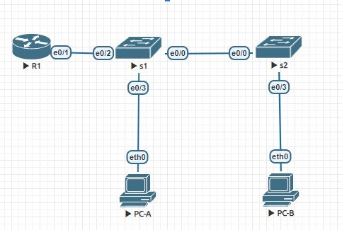

#  VLAN и маршрутизация между VLAN

###  Задание:

  1. Построить сеть и настроить основные параметры устройства;
  2. Создать VLAN и назначить порты коммутатора;
  3. Настройть магистрали 802.1Q между коммутаторами;
  4. Настроить маршруты между VLAN на маршрутизаторе;
  5. Убедиться, что маршрутизация между VLAN работает.
### 1 Карта сети:



### 2 Vlan:
Пример настройки vlan на коммутаторе S2

Добавляем порт 0/3 к Vlan 4
```
config t
(config)#vlan 4
(config-if)#interface Ethernet 0/3
(config-if)#switchport access vlan 4
exit
```
Добавляем ip 192.168.3.12 на vlan 3
```
conf t
(config)# interface vlan 3
(config-if)# ip address 192.168.3.12 255.255.255.0
(config-if)# no shutdown
```

S2#show vlan
```
VLAN Name                             Status    Ports
---- -------------------------------- --------- -------------------------------
1    default                          active

3    Management                       active

4    Operations                       active    Et0/3

7    ParkingLot                       active    Et0/1, Et0/2

8    Native                           active
```

### 3 Настройть магистрали 802.1Q между коммутаторами


Пример настройки транк порта для S2
```
config t
S2(config)#interface Ethernet 0/0
S2(config-if)#switchport trunk encapsulation dot1q
S2(config-if)#switchport mode trunk
S2(config-if)#switchport trunk native vlan 8
S2(config-if)#switchport trunk allowed vlan 3,4,8
end
```
Настроенный порт в статусе trunking
```
S2#show interfaces trunk

Port        Mode             Encapsulation  Status        Native vlan
Et0/0       on               802.1q         trunking      8

Port        Vlans allowed on trunk
Et0/0       3-4,8

Port        Vlans allowed and active in management domain
Et0/0       3-4,8

Port        Vlans in spanning tree forwarding state and not pruned
Et0/0       3-4,8
```

### 4 Настроить маршруты между VLAN на маршрутизаторе
```
R1#show ip route 
 192.168.3.0/24 is variably subnetted, 2 subnets, 2 masks
 
C        192.168.3.0/24 is directly connected, Ethernet0/1.3

L        192.168.3.1/32 is directly connected, Ethernet0/1.3

      192.168.4.0/24 is variably subnetted, 2 subnets, 2 masks
      
C        192.168.4.0/24 is directly connected, Ethernet0/1.4

L        192.168.4.1/32 is directly connected, Ethernet0/1.4
```

### 5 Проверка маршрутизации

a. Пинг с PC-A на его шлюз по умолчанию.
```
PC-A> ping 192.168.3.1

84 bytes from 192.168.3.1 icmp_seq=1 ttl=255 time=0.464 ms
```

b. Пинг с ПК-A на ПК-B
```
PC-A> ping 192.168.4.3

84 bytes from 192.168.4.3 icmp_seq=1 ttl=63 time=2.068 ms
```

c. Пинг с ПК-A на S2
```
PC-A> ping 192.168.3.12
84 bytes from 192.168.3.12 icmp_seq=1 ttl=255 time=0.455 ms
```

Шаг 2: Выполните следующий тест с помощью PC-B.

Из командной строки на PC-B отправьте команду tracert по адресу PC-A.
```
PC-B> trace 192.168.3.3

trace to 192.168.3.3, 8 hops max, press Ctrl+C to stop

 1   192.168.4.1   0.972 ms  0.574 ms  0.539 ms
 
 2   *192.168.3.3   0.741 ms (ICMP type:3, code:3, Destination port unreachable)
``` 
Вопрос: Какие промежуточные IP-адреса показаны в результатах?

Ответ: 192.168.4.1 - ip адресс виртуального интерфейса G0/0/1.4 на R1 для VLAN 4
