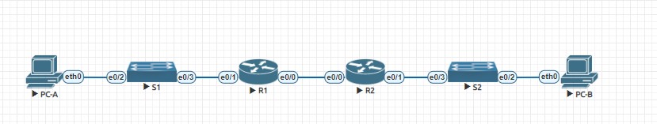

###  Настроить DHCPv6

###  Задание:

Часть 1: Построение сети и настройка основных параметров устройства

Часть 2: Проверка назначения адреса SLAAC из R1

Часть 3: Настройка и проверка сервера DHCPv6 без состояния на R1

Часть 4: Настройка и проверка сервера DHCPv6 с отслеживанием состояния на R1

Часть 5: Настройка и проверка ретранслятора DHCPv6 на R2

### Часть 1: Построение сети и настройка основных параметров устройства

Шаг 1: Подключите сеть, как показано в топологии.


### Таблица адресации

|  Device |Interface   |  IPv6 Address | link-local |
| ------------ | ------------ | ------------ |  ------------ |
| R1  |E0/0   |  2001:db8:acad:2::1/64 | fe80::1|
|   |  E0/1 | 2001:db8:acad:1::1/64  |  fe80::1 |
| R2  | E0/0  |  2001:db8:acad:2::2/64 | fe80::2 |
|   | E0/1  |  2001:db8:acad:3::1/64 | fe80::1 |
|  PC-A | NIC | DHCP  | |
|  PC-B | NIC | DHCP  | |

Шаг 2: Настройте основные параметры для каждого коммутатора.

a. Присвоите коммутатору имя устройства.
```
Switch#configure terminal 
```
```
Switch(config)#hostname S1
```
b. Отключите поиск DNS, чтобы маршрутизатор не пытался перевести неправильно введенные команды, как если бы они были именами хостов.
```
S1(config)#no ip domain-lookup
```
c. Назначьте class в качестве привилегированного зашифрованного пароля EXEC.
```
S1(config)#enable secret  class
```
d. Назначьте cisco в качестве пароля консоли и включите вход в систему.
```
S1(config)#username admin privilege 15 password cisco
S1(config)#line console 0
S1(config-line)#login local
S1(config-line)#exit
```
e. Назначьте cisco в качестве пароля VTY и включите вход в систему.
```
S1(config)#line vty 0 4
S1(config-line)#password cisco
S1(config-line)#login
S1(config-line)#exit
```
f. Зашифруйте пароли в открытом виде.
```
S1(config)#service password-encryption
```
g. Создайте баннер, предупреждающий любого, кто получает доступ к устройству, о том, что несанкционированный доступ запрещен.
```
S1(config)#banner motd #Unauthorized access is prohibited.#
```
h. Отключите все неиспользуемые порты
```
S1(config)#interface range ethernet 0/0-1
S1(config-if-range)#shutdown 
```
i. Сохраните текущую конфигурацию в файле конфигурации запуска.
```
S1#wr
```
Шаг 3: Настройте основные параметры для каждого маршрутизатора.

a. Назначьте маршрутизатору имя устройства.
```
Router(config)#hostname R1
```
b. Отключите поиск DNS, чтобы маршрутизатор не пытался перевести неправильно введенные команды, как если бы они были именами хостов.
```
R1(config)#no ip domain-lookup
```
c. Назначьте class в качестве привилегированного зашифрованного пароля EXEC.
```
R1(config)#enable secret  class
```
d. Назначьте cisco в качестве пароля консоли и включите вход в систему.
```
R1(config)#username admin privilege 15 password cisco
R1(config)#line console 0
R1(config-line)#login local
```
e. Назначьте cisco в качестве пароля VTY и включите вход в систему.
```
R1(config)#line vty 0 4
R1(config-line)#password cisco
R1(config-line)#login
```
f. Зашифруйте пароли в открытом виде.
```
R1(config)#service password-encryption
```
g. Создайте баннер, предупреждающий любого, кто получает доступ к устройству, о том, что несанкционированный доступ запрещен.
```
R1(config)#banner motd #Unauthorized access is prohibited.#
```
h. Включить маршрутизацию IPv6
```
R1(config)#ipv6 unicast-routing
```
i. Сохраните текущую конфигурацию в файле конфигурации запуска.
```
R1#wr
```

Шаг 4: Настройте интерфейсы и маршрутизацию для обоих маршрутизаторов.

a. Настройте интерфейсы E0/0 и E0/1 на R1 и R2 с IPv6-адресами, указанными в таблице выше.
```
R1(config)#interface ethernet 0/0
R1(config-if)#ipv6 address 2001:db8:acad:2::1/64
R1(config-if)#ipv6 address fe80::1 link-local
R1(config-if)#no shutdown 
R1(config)#interface ethernet 0/1
R1(config-if)#ipv6 address 2001:db8:acad:1::1/64
R1(config-if)#ipv6 address fe80::1 link-local 
R1(config-if)#no shutdown 
```
```
R2(config)#interface ethernet 0/0
R2(config-if)#ipv6 address 2001:db8:acad:2::2/64
R2(config-if)#ipv6 address fe80::2 link-local
R2(config-if)#no shutdown 
R2(config)#interface ethernet 0/1
R2(config-if)#ipv6 address 2001:db8:acad:3::1/64
R2(config-if)#ipv6 address fe80::1 link-local
R2(config-if)#no shutdown 
```
b. Настройте маршрут по умолчанию на каждом маршрутизаторе, указывающем на IP-адрес E0/0 на другом маршрутизаторе.
```
R1(config)#ipv6 route ::/0 2001:db8:acad:2::2
```
```
R2(config)#ipv6 route ::/0 2001:db8:acad:2::1
```
c. Убедитесь, что маршрутизация работает, отправив запрос на адрес R2 E0/1 из R1
```
R1#ping 2001:db8:acad:3::1
Type escape sequence to abort.
Sending 5, 100-byte ICMP Echos to 2001:DB8:ACAD:3::1, timeout is 2 seconds:
!!!!!
Success rate is 100 percent (5/5), round-trip min/avg/max = 1/3/13 ms
```
d. Сохраните текущую конфигурацию в файле конфигурации запуска.
```
R1#wr
```
### Часть 2: Проверка назначения адреса SLAAC из R1

Шаг 1: Изучите конфигурацию PC-A более подробно.

Включите PC-A и убедитесь, что сетевой адаптер настроен на автоматическую настройку IPv6.
Проверяем, что PC-A присвоил себе адрес из сети 2001:db8:1::/64.
```
PC-A> ip auto
GLOBAL SCOPE      : 2001:db8:acad:1:2050:79ff:fe66:6801/64
ROUTER LINK-LAYER : aa:bb:cc:00:50:10
```
### Часть 3: Настройка и проверка сервера DHCPv6 на R1

Шаг 1: Изучите конфигурацию PC-A более подробно.
```
PC-A> show ipv6

NAME              : PC-A[1]
LINK-LOCAL SCOPE  : fe80::250:79ff:fe66:6801/64
GLOBAL SCOPE      : 2001:db8:acad:1:2050:79ff:fe66:6801/64
DNS               :
ROUTER LINK-LAYER : aa:bb:cc:00:50:10
MAC               : 00:50:79:66:68:01
LPORT             : 20000
RHOST:PORT        : 127.0.0.1:30000
MTU:              : 1500
```
Шаг 2: Настройте R1 для предоставления DHCPv6 без состояния для PC-A.
a. Создайте пул DHCP IPv6 на R1 с именем R1-STATELESS. Как часть этого пула, назначьте адрес DNS-сервера как 2001:db8:acad::254, а доменное имя как stateless.com .

```
R1(config)# ipv6 dhcp pool R1-STATELESS
R1(config-dhcp)# dns-server 2001:db8:acad::254
R1(config-dhcp)# domain-name STATELESS.com
```
b. Настройте интерфейс E0/1 на R1, чтобы предоставить OTHER флаг конфигурации для локальной сети R1, и укажите пул DHCP, который вы только что создали, в качестве ресурса DHCP для этого интерфейса.
```
R1(config)# interface ethernet 0/1
R1(config-if)# ipv6 nd other-config-flag
R1(config-if)# ipv6 dhcp server R1-STATELESS
```
c. Сохраните текущую конфигурацию в файле конфигурации запуска.
Закройте окно настройки
d. Перезагрузите PC-A.
e. Проверьте выходные данные 
```
PC-A> show ipv6

NAME              : PC-A[1]
LINK-LOCAL SCOPE  : fe80::250:79ff:fe66:6807/64
GLOBAL SCOPE      : 2001:db8:acad:1:2050:79ff:fe66:6807/64
DNS               :
ROUTER LINK-LAYER : aa:bb:cc:00:50:10
MAC               : 00:50:79:66:68:07
LPORT             : 20000
RHOST:PORT        : 127.0.0.1:30000
MTU:              : 1500
```
f. Проверьте подключение, отправив запрос на IP-адрес интерфейса R2 E0/1.
```
PC-A> ping 2001:db8:acad:3::1

2001:db8:acad:3::1 icmp6_seq=1 ttl=63 time=9.951 ms
2001:db8:acad:3::1 icmp6_seq=2 ttl=63 time=0.649 ms
2001:db8:acad:3::1 icmp6_seq=3 ttl=63 time=0.662 ms
2001:db8:acad:3::1 icmp6_seq=4 ttl=63 time=0.695 ms
2001:db8:acad:3::1 icmp6_seq=5 ttl=63 time=0.659 ms
```
### Часть 4: Настройка сервера DHCPv6 с отслеживанием состояния на R1

a. Создайте пул DHCPv6 на R1 для сети 2001:db8:acad:3:aaaa::/80. Это предоставит адреса локальной сети, подключенной к интерфейсу E0/1 на R2. Как часть пула, задайте DNS-серверу значение 2001:db8:acad::254, а доменному имени - значение STATEFUL.com.
```
R1(config)# ipv6 dhcp pool R2-STATEFUL
R1(config-dhcp)# address prefix 2001:db8:acad:3:aaa::/80
R1(config-dhcp)# dns-server 2001:db8:acad::254
R1(config-dhcp)# domain-name STATEFUL.com
```
b. Назначьте пул DHCPv6, который вы только что создали, интерфейсу E0/0 на R1.
```
R1(config)# interface E0/0
R1(config-if)# ipv6 dhcp server R2-STATEFUL
```
### Часть 5: Настройка и проверка ретрансляции DHCPv6 на R2.


Шаг 1: Включите PC-B и проверьте адрес SLAAC, который он генерирует.
```
PC-B> show ipv6

NAME              : PC-B[1]
LINK-LOCAL SCOPE  : fe80::250:79ff:fe66:6802/64
GLOBAL SCOPE      : 2001:db8:acad:3:2050:79ff:fe66:6802/64
DNS               :
ROUTER LINK-LAYER : aa:bb:cc:00:60:10
MAC               : 00:50:79:66:68:02
LPORT             : 20000
RHOST:PORT        : 127.0.0.1:30000
MTU:              : 1500
```
В выходных данных используется префикс 2001:db8:acad:3::

Шаг 2: Настройте R2 в качестве агента ретрансляции DHCP для локальной сети на E0/1.

a. Настройте команду ретрансляции ipv6 dhcp на интерфейсе R2 E0/1, указав адрес назначения интерфейса E0/0 на R1. Также настройте команду managed-config-flag.
```
R2(config)#interface ethernet 0/1 
R2(config-if)# ipv6 nd managed-config-flag
R2(config-if)#ipv6 dhcp relay destination 2001:db8:acad:2::1 ethernet 0/0
```
b. Сохраните свою конфигурацию.
```
R2#wr
Building configuration...
[OK]
```
Шаг 3: Попытайтесь получить IPv6-адрес от DHCPv6 на ПК-B.

a. Перезагрузите компьютер PC-B.

b. Проверьте выходные данные, чтобы увидеть результаты операции ретрансляции DHCPv6.
```
PC-B> show ipv6

NAME              : PC-B[1]
LINK-LOCAL SCOPE  : fe80::250:79ff:fe66:6801/64
GLOBAL SCOPE      : 2001:db8:acad:3:2050:79ff:fe66:6801/64
DNS               :
ROUTER LINK-LAYER : aa:bb:cc:00:60:10
MAC               : 00:50:79:66:68:01
LPORT             : 20000
RHOST:PORT        : 127.0.0.1:30000
MTU:              : 1500
```
c. Проверьте подключение, отправив запрос на IP-адрес интерфейса R1 E0/1.
```
PC-B> ping 2001:db8:acad:1::1

2001:db8:acad:1::1 icmp6_seq=1 ttl=63 time=9.814 ms
2001:db8:acad:1::1 icmp6_seq=2 ttl=63 time=0.660 ms
2001:db8:acad:1::1 icmp6_seq=3 ttl=63 time=0.829 ms
2001:db8:acad:1::1 icmp6_seq=4 ttl=63 time=0.693 ms
2001:db8:acad:1::1 icmp6_seq=5 ttl=63 time=0.682 ms
```
