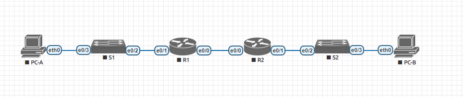

#  Лабораторная работа — реализация DHCPv4

###  Задание:

  1. Создание сети и настройка основных параметров устройства;
  2. Настройка и проверка двух серверов DHCPv4 на маршрутизаторе R1;
  3. Настройка и проверка ретрансляции DHCP на маршрутизаторе R2;
  4. Наблюдение за процессом выбора протоколом STP порта, исходя из приоритета портов;
  
### 1. Cоздание сети и настройка основных параметров устройства:

Шаг 1: Создайте схему адресации

### Таблица адресации

|  Device |Interface   |  IP Address | Subnet Mask  |  Default Gateway |
| ------------ | ------------ | ------------ | ------------ | ------------ |
| R1  |E0/0   |  10.0.0.1 | 255.255.255.252 |  N/A |
|   |  E0/1 | N/A  |  N/A |N/A   |
|   | E0/1.100  |  192.168.1.1 |255.255.255.192   |N/A |
|   | E0/1.200  | 192.168.1.65  | 255.255.255.224  | N/A |
|   |  E0/1.1000 | N/A  |  N/A | N/A  |
| R2  |  E0/0 | 10.0.0.2 |  255.255.255.252 |  N/A |
|   |  E0/1 |  192.168.1.97 |  255.255.255.240 |  N/A |
|  S1 | VLAN 200  | 192.168.1.66  |255.255.255.224   | 192.168.1.65  |
| S2  | VLAN 1 |  192.168.1.98 |  255.255.255.240 | 192.168.1.97  |
|  PC-A | NIC  |  DHCP |  DHCP |  DHCP |
|  PC-B| NIC  |  DHCP |  DHCP |  DHCP |

### Таблица VLAN

|  VLAN |  Name |  Interface Assigned |
| ------------ | ------------ | ------------ |
| 1  | N/A  | S2: E0/3  |
| 100  | Clients  |  S1: E0/3 |
|  200|  Management |  S1: VLAN 200  |
|  999 | Parking_Lot  |  S1: E0/0-1 |
| 1000  | Native  |  N/A |

Подсеть к сети 192.168.1.0/24, чтобы соответствовать следующим требованиям:
a. Одна подсеть, “Подсеть A”, поддерживающая 58 хостов (Clients VLAN на R1).
Подсеть A: 192.168.1.0/26
Введите свои ответы здесь.
Запишите первый IP-адрес в таблицу адресации для R1 E0/1.100.
192.168.1.1 255.255.255.192

b. Одна подсеть, “Подсеть B”, поддерживающая 28 хостов (Management VLAN на R1).
Подсеть B: 192.168.1.64/27
Введите свои ответы здесь.
Запишите первый IP-адрес в таблицу адресации для R1 E0/1.200. 
192.168.1.65 255.255.255.224

Запишите второй IP-адрес в таблицу адресов для S1 VLAN 200 и введите соответствующий шлюз по умолчанию.
192.168.1.66 255.255.255.224    gateway 192.168.1.65

c. Одна подсеть, “Подсеть C”, поддерживающая 12 хостов (Clients сеть в R2).
Подсеть C:192.168.1.96/28
Запишите первый IP-адрес в таблицу адресации для R2 E0/1.
192.168.1.97 255.255.255.240

Шаг 2: Подключите сеть, как показано в топологии.
Подсоедините устройства, как показано на схеме топологии, и при необходимости подключите кабель.

Настройте основные параметры для каждого маршрутизатора
начальная настройка коммутатора
a. Назначьте маршрутизатору имя устройства.
Router#configure terminal
Router(config)#hostname R1
b. Отключите поиск DNS, чтобы маршрутизатор не пытался перевести неправильно введенные команды, как если бы они были именами хостов.	
R1(config)#no ip domain-lookup	
c. Назначьте class в качестве привилегированного зашифрованного пароля EXEC.
R1(config)#enable secret  class
d. Назначьте cisco в качестве пароля консоли и включите вход в систему.	
R1(config)#username admin privilege 15 password cisco
R1(config)#line console 0
R1(config-line)#login local
R1(config-line)#exit
e. Назначьте cisco в качестве пароля VTY и включите вход в систему.
R1(config)#line vty 0 4
R1(config-line)#password cisco
R1(config-line)#login
R1(config-line)#exit
f.Зашифруйте пароли открытым текстом.	
R1(config)#service password-encryption
g. Создайте баннер, предупреждающий любого, кто получает доступ к устройству, о том, что несанкционированный доступ запрещен.	
R1(config)#banner motd #Unauthorized access is prohibited.#
R1(config)#end
h. Сохраните текущую конфигурацию в файле конфигурации запуска.
R1#wr
i.Установите часы на маршрутизаторе.	
R1#clock set 12:48:00 18 APR 2023
R1#clock update-calendar

Шаг 4: Настройте маршрутизацию между VLAN на R1
a. Активируйте интерфейс E0/1 на маршрутизаторе.
R1#configure terminal 
R1(config)#interface ethernet 0/1
R1(config-if)#no shutdown
R1(config-if)#description Trunk link to S1
b. Настройте субинтерфейсы для каждой VLAN в соответствии с требованиями таблицы IP-адресации. Все субинтерфейсы используют инкапсуляцию 802.1Q, и им присваивается первый используемый адрес из вычисленного вами пула IP-адресов. Убедитесь, что подинтерфейсу для собственной VLAN не назначен IP-адрес. Включите описание для каждого подинтерфейса.
R1(config)#interface ethernet 0/1.100
R1(config-subif)#description Default Gateway for VLAN 100
R1(config-subif)#encapsulation dot1Q 100
R1(config-subif)#ip address 192.168.1.1 255.255.255.192
R1(config-subif)#exit
R1(config)#interface ethernet 0/1.200
R1(config-subif)#description Default Gateway for VLAN 200
R1(config-subif)#encapsulation dot1Q 200
R1(config-subif)#ip address 192.168.1.65 255.255.255.224
R1(config-subif)#exit
R1(config)#interface ethernet 0/1.1000
R1(config-subif)#description Native Vlan 1000
R1(config-subif)#encapsulation dot1Q 1000 native
R1(config-subif)#exit
R1(config)#ip routing 
c. Убедитесь, что вспомогательные интерфейсы работают.
R1#show ip interface brief
Interface                  IP-Address      OK? Method Status                Protocol
Ethernet0/0                unassigned      YES unset  administratively down down
Ethernet0/1                unassigned      YES unset  up                    up
Ethernet0/1.100            192.168.1.1     YES manual up                    up
Ethernet0/1.200            192.168.1.65    YES manual up                    up
Ethernet0/1.1000           unassigned      YES unset  up                    up
Ethernet0/2                unassigned      YES unset  administratively down down
Ethernet0/3                unassigned      YES unset  administratively down down  

Шаг 5: Настройте E0/1 на R2, затем E0/0 и статическую маршрутизацию для обоих маршрутизаторов.

a. Настройте E0/1 на R2 с первым IP-адресом подсети C, который вы рассчитали ранее.
R2(config)#interface ethernet 0/1
R2(config-if)#description link to S2
R2(config-if)#ip address 192.168.1.97 255.255.255.240
R2(config-if)#no shutdown

b. Настройте интерфейс E0/0 для каждого маршрутизатора на основе приведенной выше таблицы IP-адресации.
R1(config)#interface ethernet 0/0
R1(config-if)#description Link to R2
R1(config-if)#ip address 10.0.0.1 255.255.255.252
R1(config-if)#no shutdown 

R2(config)#interface ethernet 0/0
R2(config-if)#description Link to R1
R2(config-if)#ip address 10.0.0.2 255.255.255.252
R2(config-if)#no shutdown
R2(config-if)#end
R2(config)#ip routing 

c. Настройте маршрут по умолчанию на каждом маршрутизаторе, указывающем на IP-адрес E0/0 на другом маршрутизаторе.
R1(config)#ip default-gateway 10.0.0.2
R1(config)# ip route 192.168.1.96 255.255.255.240 10.0.0.2
R1(config)# ip route 0.0.0.0 255.255.255.0 10.0.0.2
R2(config)#ip default-gateway 10.0.0.1
R2(config)# ip route 192.168.1.64 255.255.255.224 10.0.0.1

d. Убедитесь, что статическая маршрутизация работает, отправив запрос на адрес R2 E0/1 из R1.
R1#ping 192.168.1.97
Type escape sequence to abort.
Sending 5, 100-byte ICMP Echos to 192.168.1.97, timeout is 2 seconds:
!!!!!
Success rate is 100 percent (5/5), round-trip min/avg/max = 1/1/1 ms

e. Сохраните текущую конфигурацию в файле конфигурации запуска.
R1#wr
Building configuration...
[OK]
R2#wr
Building configuration...
[OK]

Шаг 6: Настройте основные параметры для каждого коммутатора.
a. Присвоите коммутатору имя устройства.
Switch(config)#hostname S1
b. Отключите поиск DNS, чтобы маршрутизатор не пытался перевести неправильно введенные команды, как если бы они были именами хостов.
S1(config)#no ip domain-lookup 
c. Назначьте class в качестве привилегированного зашифрованного пароля EXEC.
S1(config)#enable secret  class
d. Назначьте cisco в качестве пароля консоли и включите вход в систему.
S1(config)#username admin privilege 15 password cisco
S1(config)#line console 0
S1(config-line)#login local
S1(config-line)#exit
e. Назначьте cisco в качестве пароля VTY и включите вход в систему.
S1(config)#line vty 0 4
S1(config-line)#password cisco
S1(config-line)#login
S1(config-line)#exit
f. Зашифруйте пароли в открытом виде.
S1(config)#service password-encryption
g. Создайте баннер, предупреждающий любого, кто получает доступ к устройству, о том, что несанкционированный доступ запрещен.
S1(config)#banner motd #Unauthorized access is prohibited.#
h. Сохраните текущую конфигурацию в файле конфигурации запуска.
S1#wr
i. Установите часы на коммутаторе на сегодняшнее время и дату.
S1#clock set 14:45:00 18 APR 2023 
S1#clock update-calendar
j. Скопируйте текущую конфигурацию в конфигурацию запуска.
S1#copy running-config startup-config
Destination filename [startup-config]?
Building configuration...
Compressed configuration from 1015 bytes to 738 bytes[OK]

Шаг 7: Создайте VLAN на S1

a. Создайте и назовите необходимые VLAN на коммутаторе 1 из приведенной выше таблицы

S1(config)#vlan 200
S1(config)#vlan 999
S1(config)#vlan 1000
S1(config)#interface vlan 100
S1(config-if)#description Clients
S1(config-if)#no shutdown 
S1(config)#interface vlan 200
S1(config-if)#description Management
S1(config-if)#no shutdown 
S1(config)#interface vlan 999
S1(config-if)#description Parking_Lot
S1(config-if)#no shutdown 
S1(config)#interface vlan 1000
S1(config-if)#description Native
S1(config-if)#no shutdown 

b. Настройте и активируйте интерфейс управления на S1 (VLAN 200), используя второй IP-адрес из подсети, рассчитанный ранее. Кроме того, установите шлюз по умолчанию на S1.
S1(config)#interface vlan 200
S1(config-if)#ip address 192.168.1.66 255.255.255.224
S1(config-if)#no shutdown 
S1(config)#ip default-gateway 192.168.1.65

c. Настройте и активируйте интерфейс управления на S2 (VLAN 1), используя второй IP-адрес из подсети, рассчитанный ранее. Кроме того, установите шлюз по умолчанию на S2
S2(config)#interface vlan 1
S2(config-if)#ip address 192.168.1.98 255.255.255.240
S2(config-if)#no shutdown
S2(config)#ip default-gateway 192.168.1.97

d. Назначьте все неиспользуемые порты на S1 VLAN Parking_Lot, настройте их для статического режима доступа и деактивируйте их в административном порядке. На S2 административно деактивируйте все неиспользуемые порты.
S1(config)#interface range ethernet 0/0-1
S1(config-if-range)#switchport mode access
S1(config-if-range)#switchport access vlan 999
S1(config-if-range)#shutdown 
S2(config)#interface range ethernet 0/0-1
S2(config-if-range)#shutdown 

Шаг 8: Назначьте VLAN правильным интерфейсам коммутатора.
a. Назначьте используемые порты соответствующей VLAN (указанной в таблице VLAN выше) и настройте их для статического режима доступа.
S1(config)#interface ethernet 0/3
S1(config-if)#switchport mode access
S1(config-if)#switchport access vlan 100
b. Убедитесь, что VLAN назначены правильным интерфейсам
S1#show vlan

VLAN Name                             Status    Ports
---- -------------------------------- --------- -------------------------------
1    default                          active    Et0/2
100  VLAN0100                         active    Et0/3
200  VLAN0200                         active
999  VLAN0999                         active    Et0/0, Et0/1
1000 VLAN1000                         active
1002 fddi-default                     act/unsup
1003 token-ring-default               act/unsup
1004 fddinet-default                  act/unsup
1005 trnet-default                    act/unsup 

Вопрос: почему интерфейс E0/2 указан в разделе VLAN 1?
Ему не назначали Vlan он планируется для транкового порта.

Шаг 9: Вручную настройте интерфейс S1 E0/2 в качестве магистрали 802.1Q.
a. Измените режим switchport на интерфейсе для принудительного подключения к магистрали.
S1(config)#interface ethernet 0/2
S1(config-if)#switchport trunk encapsulation dot1q
S1(config-if)#switchport mode trunk 
b. Как часть конфигурации магистрали, установите для собственной VLAN значение 1000.
S1(config-if)#switchport trunk native vlan 1000 
c. В качестве другой части конфигурации магистрали укажите, что VLAN 100, 200 и 1000 разрешено пересекать магистраль.
S1(config-if)#switchport trunk allowed vlan 100,200,1000
d. Сохраните текущую конфигурацию в файле конфигурации запуска.
S1#wr
e. Проверьте состояние транкинга.
S1#show interfaces trunk

Port        Mode             Encapsulation  Status        Native vlan
Et0/2       on               802.1q         trunking      1000

Port        Vlans allowed on trunk
Et0/2       100,200,1000

Port        Vlans allowed and active in management domain
Et0/2       100,200,1000

Port        Vlans in spanning tree forwarding state and not pruned
Et0/2       100,200,1000

Вопрос: на данный момент, какой IP-адрес был бы у ПК, если бы они были подключены к сети с помощью DHCP?
Ответ: 192.168.1.62

Часть 2: Настройка и проверка двух серверов DHCPv4 на R1

A. Исключите первые пять доступных адресов из каждого пула адресов.
R1(config)#ip dhcp excluded-address 192.168.1.1 192.168.1.5
R1(config)#ip dhcp excluded-address 192.168.1.97 192.168.1.101
b. Создайте пул DHCP (используйте уникальное имя для каждого пула).
R1(config)#ip dhcp POol POOL-A
c. Укажите сеть, которую поддерживает этот DHCP-сервер.
network 192.168.1.0 255.255.255.192
d. Настройте доменное имя следующим образом ccna-lab.com
R1(dhcp-config)#domain-name ccna-lab.com
e. Настройте соответствующий шлюз по умолчанию для каждого пула DHCP.
R1(dhcp-config)#default-router 192.168.1.1
f. Настройте время аренды на 2 дня 12 часов 30 минут.
lease 2 12 30

g. Далее настройте второй пул DHCPv4, используя имя пула R2_Client_LAN и вычисляемую сеть, маршрутизатор по умолчанию, и используйте то же доменное имя и время аренды, что и в предыдущем пуле DHCP.
R1(dhcp-config)#netw
R1(dhcp-config)#network 192.168.1.96 255.255.255.240
R1(dhcp-config)#domain-name ccna-lab.com
R1(dhcp-config)#default-router 192.168.1.97
R1(dhcp-config)#lease 2 12 30
R1(dhcp-config)#end
Шаг 2: Сохраните свою конфигурацию
R1#wr
Building configuration...
[OK]

Шаг 3: Проверьте конфигурацию сервера DHCPv4
a. Выполните команду show ip dhcp pool, чтобы просмотреть сведения о пуле.
R1#show ip dhcp pool

Pool POOL-A :
 Utilization mark (high/low)    : 100 / 0
 Subnet size (first/next)       : 0 / 0
 Total addresses                : 62
 Leased addresses               : 0
 Pending event                  : none
 1 subnet is currently in the pool :
 Current index        IP address range                    Leased addresses
 192.168.1.1          192.168.1.1      - 192.168.1.62      0

Pool R2_Client_LAN :
 Utilization mark (high/low)    : 100 / 0
 Subnet size (first/next)       : 0 / 0
 Total addresses                : 14
 Leased addresses               : 0
 Pending event                  : none
 1 subnet is currently in the pool :
 Current index        IP address range                    Leased addresses
 192.168.1.97         192.168.1.97     - 192.168.1.110     0
b. Выполните команду show ip dhcp bindings, чтобы проверить установленные назначения DHCP-адресов.
R1#show ip dhcp binding
Bindings from all pools not associated with VRF:
IP address          Client-ID/              Lease expiration        Type
                    Hardware address/
                    User name
c. Выполните команду show ip dhcp server statistics для проверки сообщений DHCP.
R1#show ip dhcp server statistics
Memory usage         25168
Address pools        2
Database agents      0
Automatic bindings   0
Manual bindings      0
Expired bindings     0
Malformed messages   0
Secure arp entries   0

Message              Received
BOOTREQUEST          0
DHCPDISCOVER         0
DHCPREQUEST          0
DHCPDECLINE          0
DHCPRELEASE          0
DHCPINFORM           0

Message              Sent
BOOTREPLY            0
DHCPOFFER            0
DHCPACK              0
DHCPNAK              0
Шаг 4: Попытайтесь получить IP-адрес от DHCP на PC-A

a. PC-A получем адрес от DHCP сервера
PC-A> ip dhcp
DDORA IP 192.168.1.6/26 GW 192.168.1.1 
b. Как только процесс обновления будет завершен, выполните команду, чтобы просмотреть информацию о новом IP.
PC-A> show

NAME   IP/MASK              GATEWAY                             GATEWAY
PC-A   192.168.1.6/26       192.168.1.1
       fe80::250:79ff:fe66:6801/64

c. Проверьте подключение, отправив запрос на IP-адрес интерфейса R1 E0/1.
PC-A> ping 192.168.1.1

84 bytes from 192.168.1.1 icmp_seq=1 ttl=255 time=0.409 ms
84 bytes from 192.168.1.1 icmp_seq=2 ttl=255 time=0.623 ms
84 bytes from 192.168.1.1 icmp_seq=3 ttl=255 time=0.663 ms
84 bytes from 192.168.1.1 icmp_seq=4 ttl=255 time=0.622 ms
84 bytes from 192.168.1.1 icmp_seq=5 ttl=255 time=0.662 ms

Часть 3: Настройка и проверка DHCP-ретранслятора на R2
В части 3 вы настроите R2 для ретрансляции DHCP-запросов из локальной сети по интерфейсу E0/1 на DHCP-сервер (R1).
Шаг 1: Настройте R2 в качестве агента ретрансляции DHCP для локальной сети на E0/1
a. Настройте команду ip helper-address для E0/1, указав IP-адрес R1 для E0/0.
R2(config)#interface ethernet 0/1
R2(config-if)#ip helper-address 10.0.0.1
Шаг 2: Попытайтесь получить IP-адрес от DHCP на PC-B

a. Откройте командную строку на PC-B и введите команду ipconfig /renew.
PC-B> ip dhcp
DDORA IP 192.168.1.102/28 GW 192.168.1.97
b. Как только процесс обновления будет завершен, выполните команду ipconfig, чтобы просмотреть информацию о новом IP.
PC-B> show

NAME   IP/MASK              GATEWAY                             GATEWAY
PC-B   192.168.1.102/28     192.168.1.97
       fe80::250:79ff:fe66:6802/64
c. Проверьте подключение, отправив запрос на IP-адрес интерфейса R1 E0/1.
PC-B> ping 10.0.0.1

84 bytes from 10.0.0.1 icmp_seq=1 ttl=254 time=0.630 ms
84 bytes from 10.0.0.1 icmp_seq=2 ttl=254 time=0.716 ms
84 bytes from 10.0.0.1 icmp_seq=3 ttl=254 time=0.813 ms
84 bytes from 10.0.0.1 icmp_seq=4 ttl=254 time=0.787 ms
84 bytes from 10.0.0.1 icmp_seq=5 ttl=254 time=0.757 ms
d. Установите привязку show ip dhcp на R1, чтобы проверить привязки DHCP.
R1#show ip dhcp binding
Bindings from all pools not associated with VRF:
IP address          Client-ID/              Lease expiration        Type
                    Hardware address/
                    User name
192.168.1.6         0100.5079.6668.01       Apr 21 2023 02:03 AM    Automatic
192.168.1.102       0100.5079.6668.02       Apr 21 2023 02:40 AM    Automatic

e. Выполните команду показать статистику ip dhcp-сервера на R1 и R2 для проверки сообщений DHCP.
R1#show ip dhcp binding
Bindings from all pools not associated with VRF:
IP address          Client-ID/              Lease expiration        Type
                    Hardware address/
                    User name
192.168.1.6         0100.5079.6668.01       Apr 21 2023 02:03 AM    Automatic
192.168.1.102       0100.5079.6668.02       Apr 21 2023 02:40 AM    Automatic
R1#show ip dhcp server statistics
Memory usage         42086
Address pools        2
Database agents      0
Automatic bindings   2
Manual bindings      0
Expired bindings     0
Malformed messages   0
Secure arp entries   0

Message              Received
BOOTREQUEST          0
DHCPDISCOVER         4
DHCPREQUEST          2
DHCPDECLINE          0
DHCPRELEASE          0
DHCPINFORM           0

Message              Sent
BOOTREPLY            0
DHCPOFFER            2
DHCPACK              2
DHCPNAK              0

R2#show ip dhcp server statistics
Memory usage         22565
Address pools        0
Database agents      0
Automatic bindings   0
Manual bindings      0
Expired bindings     0
Malformed messages   0
Secure arp entries   0

Message              Received
BOOTREQUEST          0
DHCPDISCOVER         0
DHCPREQUEST          0
DHCPDECLINE          0
DHCPRELEASE          0
DHCPINFORM           0

Message              Sent
BOOTREPLY            0
DHCPOFFER            0
DHCPACK              0
DHCPNAK              0

