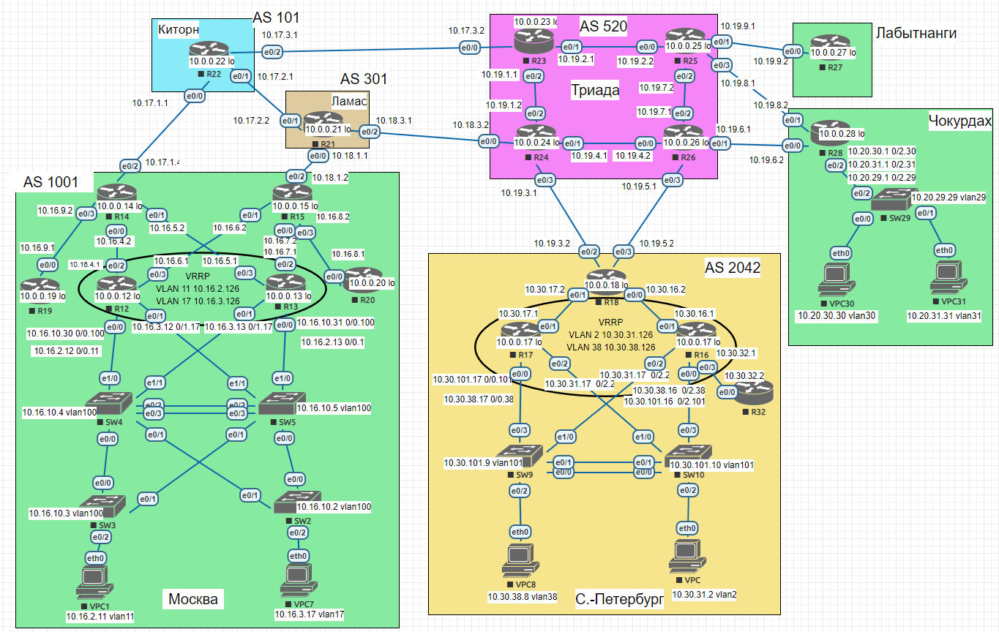

#  Лабораторная работа — реализация DHCPv4

###  Задание:

1.Разработаете и задокументируете адресное пространство для лабораторного стенда.

2.Настроите ip адреса на каждом активном порту

3.Настроите каждый VPC в каждом офисе в своем VLAN.

4.Настроите VLAN/Loopbackup interface управления для сетевых устройств

5.Настроите сети офисов так, чтобы не возникало broadcast штормов, а использование линков было максимально оптимизировано

6.Используете IPv4. IPv6 по желанию
  
### 1. Адресное пространство

#### Москва AS 1001

| Device | Interface | IP Address | Subnet Mask | Default Gateway | VLAN |
|--------|-----------|------------|-------------|-----------------|------|
| SW2    | vlan 100  | 10.16.10.2 | 255.255.255.0 | N/A           | 100  |
| SW2    | e0/2      | N/A        | N/A         | N/A             | 17   |
| SW3    | vlan 100  | 10.16.10.3 | 255.255.255.0 | N/A           | 100  |
| SW3    | e0/2      | N/A        | N/A         | N/A             | 11   |
| SW4    | vlan 100  | 10.16.10.4 | 255.255.255.0 | N/A           | 100  |
| SW5    | vlan 100  | 10.16.10.5 | 255.255.255.0 | N/A           | 100  |
| R12    | Loopback  | 10.0.0.12  | 255.255.255.0 | N/A           | N/A  |
| R12    | e0/2      | 10.16.4.1  | 255.255.255.0 | N/A           | N/A  |
| R12    | e0/3      | 10.16.6.1  | 255.255.255.0 | N/A           | N/A  |
| R12    | e0/0.11   | 10.16.2.12 | 255.255.255.0 | N/A           | 11   |
| R12    | e0/0.11 VRRP Gr11 | 10.16.2.126 | N/A     | N/A           | 11   |
| R12    | e0/0.17 VRRP Gr17 | 10.16.3.126 | N/A     | N/A           | 17   |
| R12    | e0/0.100  | 10.16.10.30 | 255.255.255.0 | N/A         | 100  |
| R12    | e0/1.17   | 10.16.3.12 | 255.255.255.0 | N/A           | 17   |
| R13    | Loopback  | 10.0.0.13  | 255.255.255.0 | N/A           | N/A  |
| R13    | e0/3      | 10.16.5.1  | 255.255.255.0 | N/A           | N/A  |
| R13    | e0/2      | 10.16.7.1  | 255.255.255.0 | N/A           | N/A  |
| R13    | e0/0.11   | 10.16.2.13 | 255.255.255.0 | N/A           | 11   |
| R13    | e0/0.11 VRRP Gr11 | 10.16.2.126 | N/A     | N/A           | 11   |
| R13    | e0/1.17   | 10.16.3.13 | 255.255.255.0 | N/A           | 17   |
| R13    | e0/1.17 VRRP Gr17 | 10.16.3.126 | N/A     | N/A           | 17   |
| R13    | e0/0.100  | 10.16.10.31 | 255.255.255.0 | N/A         | 100  |
| R14    | Loopback  | 10.0.0.14  | 255.255.255.0 | N/A           | N/A  |
| R14    | e0/0      | 10.16.4.2  | 255.255.255.0 | N/A           | N/A  |
| R14    | e0/1      | 10.16.5.2  | 255.255.255.0 | N/A           | N/A  |
| R14    | e0/3      | 10.16.9.2  | 255.255.255.0 | N/A           | N/A  |
| R14    | e0/2      | 10.17.1.4  | 255.255.255.0 | N/A           | N/A  |
| R15    | Loopback  | 10.0.0.15  | 255.255.255.0 | N/A           | N/A  |
| R15    | e0/1      | 10.16.6.2  | 255.255.255.0 | N/A           | N/A  |
| R15    | e0/0      | 10.16.7.2  | 255.255.255.0 | N/A           | N/A  |
| R15    | e0/3      | 10.16.8.2  | 255.255.255.0 | N/A           | N/A  |
| R15    | e0/2      | 10.18.1.2  | 255.255.255.0 | N/A           | N/A  |
| R20    | Loopback  | 10.0.0.20  | 255.255.255.0 | N/A           | N/A  |
| R20    | e0/0      | 10.16.8.1  | 255.255.255.0 | N/A           | N/A  |
| R19    | Loopback  | 10.0.0.19  | 255.255.255.0 | N/A           | N/A  |
| R19    | e0/0      | 10.16.9.1  | 255.255.255.0 | N/A           | N/A  |
| VPC1   | NIC       | 10.16.2.11 | 255.255.255.0 | 10.16.2.126   | 11   |
| VPC7   | NIC       | 10.16.3.17 | 255.255.255.0 | 10.16.3.126   | 17   |

#### Санкт - Петербург
|  Device |Interface   |  IP Address | Subnet Mask  |  Default Gateway | VLAN |
| ------------ | ------------ | ------------ | ------------ | ------------ | ------------ |
| SW9  |VLAN 101  |  10.30.101.9  | 255.255.255.0 |  N/A | 101|
| SW9  |e0/2  |  N/A  | N/A |  N/A | 38|
| SW10  |VLAN 101  |  10.30.101.10  | 255.255.255.0 |  N/A | 101|
| SW10  |e0/2  |  N/A  | N/A |  N/A | 2|
| VPC8  |NIC  |  10.30.38.8  | 255.255.255.0 |  10.30.38.126 | 38|
| VPC  |NIC  |  10.30.31.2  | 255.255.255.0 |  10.30.31.126 | 2|
| R17  |Loopback  |  10.0.0.17  | 255.255.255.0 |  N/A | N/A|
| R17  |e0/0.101  |  10.30.101.17  | 255.255.255.0 |  N/A | 101|
| R17  |e0/0.38  |  10.30.38.17  | 255.255.255.0 |  N/A | 38|
| R17  |e0/2.2  |  10.30.31.17  | 255.255.255.0 |  N/A | 2|
| R17  |e0/1  |  10.30.17.1  | 255.255.255.0 |  N/A | N/A|
| R17  |e0/0.38 VRRP Gr38  |  10.30.38.126  | N/A |  N/A | 38|
| R17  |e0/0.2 VRRP Gr2  |  10.30.31.126  | N/A |  N/A | 2|
| R16  |Loopback  |  10.0.0.16  | 255.255.255.0 |  N/A | N/A|
| R16  |e0/0.101  |  10.30.101.16  | 255.255.255.0 |  N/A | 101|
| R16  |e0/0.38  |  10.30.38.16  | 255.255.255.0 |  N/A | 38|
| R16  |e0/2.2  |  10.30.31.16  | 255.255.255.0 |  N/A | 2|
| R16  |e0/1  |  10.30.16.1  | 255.255.255.0 |  N/A | N/A|
| R16  |e0/1  |   10.30.16.1  | 255.255.255.0 |  N/A | N/A|
| R16  |e0/3  |  10.30.32.1  | 255.255.255.0 |  N/A | N/A|
| R16  |e0/0.38 VRRP Gr38  |  10.30.38.126  | N/A |  N/A | 38|
| R16  |e0/0.2 VRRP Gr2  |  10.30.31.126  | N/A |  N/A | 2|
| R18  |Loopback  |  10.0.0.18  | 255.255.255.0 |  N/A | N/A|
| R18  |e0/0  |  10.30.16.2  | 255.255.255.0 |  N/A | N/A|
| R18  |e0/1  |  10.30.17.2  | 255.255.255.0 |  N/A | N/A|
| R18  |e0/2  |  10.19.3.2  | 255.255.255.0 |  N/A | N/A|
| R18  |e0/3  |  10.19.5.2  | 255.255.255.0 |  N/A | N/A|
| R32  |Loopback  |  10.0.0.32  | 255.255.255.0 |  N/A | N/A|
| R32  |e0/0  |  10.30.32.2  | 255.255.255.0 |  N/A | N/A|

#### Триада AS 520
|  Device |Interface   |  IP Address | Subnet Mask  |  Default Gateway | VLAN |
| ------------ | ------------ | ------------ | ------------ | ------------ | ------------ |
| R23  |e0/0  |  10.17.3.2  | 255.255.255.0 |  N/A | N/A|
| R23  |e0/1  |  10.19.2.1  | 255.255.255.0 |  N/A | N/A|
| R23  |e0/2  |  10.19.1.1  | 255.255.255.0 |  N/A | N/A|
| R23  |Loopback  |  10.0.0.23  | 255.255.255.0 |  N/A | N/A|
| R24  |Loopback  |  10.0.0.24  | 255.255.255.0 |  N/A | N/A|
| R24  |e0/0  |  10.18.3.2  | 255.255.255.0 |  N/A | N/A|
| R24  |e0/3  |  10.19.3.1  | 255.255.255.0 |  N/A | N/A|
| R24  |e0/1  |  10.19.4.1  | 255.255.255.0 |  N/A | N/A|
| R24  |e0/2  |   10.19.1.2  | 255.255.255.0 |  N/A | N/A|
| R26  |e0/0  |  10.19.4.2  | 255.255.255.0 |  N/A | N/A|
| R26  |Loopback  |  10.0.0.26  | 255.255.255.0 |  N/A | N/A|
| R26  |e0/3  |  10.19.5.1  | 255.255.255.0 |  N/A | N/A|
| R26  |e0/1  |  10.19.6.1  | 255.255.255.0 |  N/A | N/A|
| R26  |e0/2  |  10.19.7.1  | 255.255.255.0 |  N/A | N/A|
| R25  |e0/0  |  10.19.2.2  | 255.255.255.0 |  N/A | N/A|
| R25  |e0/1  |  10.19.9.1  | 255.255.255.0 |  N/A | N/A|
| R25  |e0/2  |  10.19.7.2  | 255.255.255.0 |  N/A | N/A|
| R25  |e0/3  |  10.19.8.1  | 255.255.255.0 |  N/A | N/A|

#### Киторн AS 101
|  Device |Interface   |  IP Address | Subnet Mask  |  Default Gateway | VLAN |
| ------------ | ------------ | ------------ | ------------ | ------------ | ------------ |
| R22  |e0/0  |  10.17.1.1  | 255.255.255.0 |  N/A | N/A|
| R22  |e0/1  |  10.17.2.1  | 255.255.255.0 |  N/A | N/A|
| R22  |e0/2  |  10.17.3.1  | 255.255.255.0 |  N/A | N/A|
| R22  |Loopback  |  10.0.0.22  | 255.255.255.0 |  N/A | N/A|

#### Ламас AS 301
|  Device |Interface   |  IP Address | Subnet Mask  |  Default Gateway | VLAN |
| ------------ | ------------ | ------------ | ------------ | ------------ | ------------ |
| R21  |e0/0  |  10.18.1.1  | 255.255.255.0 |  N/A | N/A|
| R21  |e0/1  |  10.17.2.2  | 255.255.255.0 |  N/A | N/A|
| R21  |e0/2  |  10.18.3.1  | 255.255.255.0 |  N/A | N/A|
| R21  |Loopback  |  10.0.0.21  | 255.255.255.0 |  N/A | N/A|

#### Лабытнаги
|  Device |Interface   |  IP Address | Subnet Mask  |  Default Gateway | VLAN |
| ------------ | ------------ | ------------ | ------------ | ------------ | ------------ |
| R27  |Loopback  |  10.19.9.2  | 255.255.255.0 |  N/A | N/A|
| R27  |e0/0  |  10.0.0.27  | 255.255.255.0 |  N/A | N/A|

#### Чокурдах
|  Device |Interface   |  IP Address | Subnet Mask  |  Default Gateway | VLAN |
| ------------ | ------------ | ------------ | ------------ | ------------ | ------------ |
| VPC30  |NIC  |  10.20.30.30  | 255.255.255.0 |  10.20.30.1 | 30|
| VPC31  |NIC  |  10.20.31.31  | 255.255.255.0 |  10.20.31.1 | 31|
| SW29  |VLAN 29  |  10.20.29.29  | 255.255.255.0 |  N/A | 29|
| SW29  |e0/0  |  N/A | N/A |  N/A | 30|
| SW29  |e0/1  |  N/A | N/A |  N/A | 31|
| R28  |e0/0  |  10.19.6.2  | 255.255.255.0 |  N/A | N/A|
| R28  |e0/1  |  10.19.8.2  | 255.255.255.0 |  N/A | N/A|
| R28  |Loopback  |  10.0.0.27  | 255.255.255.0 |  N/A | N/A|
| R28  |e0/2.30  |  10.20.30.1  | 255.255.255.0 |  N/A | 30|
| R28  |e0/2.31  |  10.20.31.1  | 255.255.255.0 |  N/A | 31|
| R28  |e0/2.29  |  10.20.29.1  | 255.255.255.0 |  N/A | 29|

### 2: Настроите ip адреса на каждом активном порту
