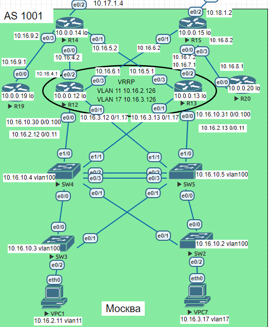

## Цель:
Настроить OSPF офисе Москва

Разделить сеть на зоны

Настроить фильтрацию между зонами


## Задачи.

1. Маршрутизаторы R14-R15 находятся в зоне 0 - backbone.
2. Маршрутизаторы R12-R13 находятся в зоне 10. Дополнительно к маршрутам должны получать маршрут по умолчанию.
3. Маршрутизатор R19 находится в зоне 101 и получает только маршрут по умолчанию.
4. Маршрутизатор R20 находится в зоне 102 и получает все маршруты, кроме маршрутов до сетей зоны 101.

### Часть карты участвующая в задании


### 1. Маршрутизаторы R14-R15 в зоне 0 (backbone):

```
R14
router ospf 1
 area 101 stub no-summary
 network 10.16.4.0 0.0.0.255 area 10
 network 10.16.5.0 0.0.0.255 area 10
 network 10.16.9.0 0.0.0.255 area 101
 network 10.17.1.0 0.0.0.255 area 0
 default-information originate
```

```
R15
router ospf 1
 network 10.16.6.0 0.0.0.255 area 10
 network 10.16.7.0 0.0.0.255 area 10
 network 10.16.8.0 0.0.0.255 area 102
 network 10.18.1.0 0.0.0.255 area 0
 default-information originate
```

```
R14#show ip ospf database

            OSPF Router with ID (10.0.0.14) (Process ID 1)

                Router Link States (Area 0)

Link ID         ADV Router      Age         Seq#       Checksum Link count
10.0.0.14       10.0.0.14       798         0x80000004 0x00BA1C 1

                Summary Net Link States (Area 0)

Link ID         ADV Router      Age         Seq#       Checksum
10.0.0.12       10.0.0.14       798         0x80000005 0x0046B9
10.0.0.13       10.0.0.14       71          0x80000006 0x003AC3
10.0.0.19       10.0.0.14       236         0x80000001 0x0008F4
10.16.2.0       10.0.0.14       798         0x80000004 0x0044AD
10.16.3.0       10.0.0.14       798         0x80000004 0x0039B7
10.16.4.0       10.0.0.14       798         0x80000004 0x00C930
10.16.5.0       10.0.0.14       71          0x80000006 0x00BA3C
10.16.6.0       10.0.0.14       798         0x80000004 0x0018D5
10.16.7.0       10.0.0.14       71          0x80000005 0x000BE0
10.16.9.0       10.0.0.14       798         0x80000004 0x009262
10.16.10.0      10.0.0.14       798         0x80000004 0x00EBFD

                Summary ASB Link States (Area 0)

Link ID         ADV Router      Age         Seq#       Checksum
10.0.0.12       10.0.0.14       798         0x80000004 0x0030D0
10.0.0.13       10.0.0.14       71          0x80000006 0x0022DB
10.0.0.15       10.0.0.14       798         0x80000004 0x00767D

                Router Link States (Area 10)

Link ID         ADV Router      Age         Seq#       Checksum Link count
10.0.0.12       10.0.0.12       1317        0x80000030 0x000B8B 6
10.0.0.13       10.0.0.13       113         0x80000034 0x005C2C 6
10.0.0.14       10.0.0.14       71          0x8000000C 0x003B17 2
10.0.0.15       10.0.0.15       995         0x8000000E 0x00AF96 2

                Net Link States (Area 10)

Link ID         ADV Router      Age         Seq#       Checksum
10.16.2.13      10.0.0.13       113         0x8000002D 0x00A2FD
10.16.3.13      10.0.0.13       113         0x8000002D 0x009708
10.16.4.1       10.0.0.12       1317        0x8000000A 0x00636A
10.16.5.1       10.0.0.13       113         0x80000004 0x006868
10.16.6.1       10.0.0.12       1317        0x8000000A 0x005B6F
10.16.7.1       10.0.0.13       1099        0x8000000A 0x005473
10.16.10.31     10.0.0.13       113         0x8000002D 0x0095F0

                Summary Net Link States (Area 10)

Link ID         ADV Router      Age         Seq#       Checksum
10.0.0.19       10.0.0.14       236         0x80000001 0x0008F4
10.0.0.20       10.0.0.15       995         0x80000004 0x00F106
10.16.8.0       10.0.0.15       995         0x80000004 0x00975D
10.16.9.0       10.0.0.14       798         0x80000004 0x009262
10.17.1.0       10.0.0.14       798         0x80000004 0x00DE1D
10.18.1.0       10.0.0.15       995         0x80000004 0x00CC2D

                Summary ASB Link States (Area 10)

Link ID         ADV Router      Age         Seq#       Checksum
10.0.0.20       10.0.0.15       995         0x80000004 0x00D91E

                Router Link States (Area 101)

Link ID         ADV Router      Age         Seq#       Checksum Link count
10.0.0.14       10.0.0.14       241         0x80000016 0x00AAF1 1
10.0.0.19       10.0.0.19       245         0x80000008 0x00BBB8 2

                Net Link States (Area 101)

Link ID         ADV Router      Age         Seq#       Checksum
10.16.9.1       10.0.0.19       240         0x80000003 0x00744F

                Summary Net Link States (Area 101)

Link ID         ADV Router      Age         Seq#       Checksum
0.0.0.0         10.0.0.14       247         0x80000001 0x000323

                Type-5 AS External Link States

Link ID         ADV Router      Age         Seq#       Checksum Tag
0.0.0.0         10.0.0.14       556         0x8000000D 0x002543 1
```

```
R14#show ip route
Codes: L - local, C - connected, S - static, R - RIP, M - mobile, B - BGP
       D - EIGRP, EX - EIGRP external, O - OSPF, IA - OSPF inter area
       N1 - OSPF NSSA external type 1, N2 - OSPF NSSA external type 2
       E1 - OSPF external type 1, E2 - OSPF external type 2
       i - IS-IS, su - IS-IS summary, L1 - IS-IS level-1, L2 - IS-IS level-2
       ia - IS-IS inter area, * - candidate default, U - per-user static route
       o - ODR, P - periodic downloaded static route, H - NHRP, l - LISP
       a - application route
       + - replicated route, % - next hop override

Gateway of last resort is 10.17.1.1 to network 0.0.0.0

S*    0.0.0.0/0 [1/0] via 10.17.1.1
      10.0.0.0/8 is variably subnetted, 21 subnets, 2 masks
C        10.0.0.0/24 is directly connected, Loopback0
O        10.0.0.12/32 [110/11] via 10.16.4.1, 00:31:25, Ethernet0/0
O        10.0.0.13/32 [110/11] via 10.16.5.1, 00:20:26, Ethernet0/1
L        10.0.0.14/32 is directly connected, Loopback0
O        10.0.0.19/32 [110/11] via 10.16.9.1, 00:31:25, Ethernet0/3
O IA     10.0.0.20/32 [110/31] via 10.16.5.1, 00:20:26, Ethernet0/1
                      [110/31] via 10.16.4.1, 00:31:25, Ethernet0/0
O        10.16.2.0/24 [110/20] via 10.16.5.1, 00:20:26, Ethernet0/1
                      [110/20] via 10.16.4.1, 00:26:17, Ethernet0/0
O        10.16.3.0/24 [110/20] via 10.16.5.1, 00:20:26, Ethernet0/1
                      [110/20] via 10.16.4.1, 00:26:11, Ethernet0/0
C        10.16.4.0/24 is directly connected, Ethernet0/0
L        10.16.4.2/32 is directly connected, Ethernet0/0
C        10.16.5.0/24 is directly connected, Ethernet0/1
L        10.16.5.2/32 is directly connected, Ethernet0/1
O        10.16.6.0/24 [110/20] via 10.16.4.1, 00:31:25, Ethernet0/0
O        10.16.7.0/24 [110/20] via 10.16.5.1, 00:20:26, Ethernet0/1
O IA     10.16.8.0/24 [110/30] via 10.16.5.1, 00:20:26, Ethernet0/1
                      [110/30] via 10.16.4.1, 00:31:25, Ethernet0/0
C        10.16.9.0/24 is directly connected, Ethernet0/3
L        10.16.9.2/32 is directly connected, Ethernet0/3
O        10.16.10.0/24 [110/20] via 10.16.5.1, 00:20:26, Ethernet0/1
                       [110/20] via 10.16.4.1, 00:31:25, Ethernet0/0
C        10.17.1.0/24 is directly connected, Ethernet0/2
L        10.17.1.4/32 is directly connected, Ethernet0/2
O IA     10.18.1.0/24 [110/30] via 10.16.5.1, 00:20:26, Ethernet0/1
                      [110/30] via 10.16.4.1, 00:31:25, Ethernet0/0
```

```
R15#show ip ospf database

            OSPF Router with ID (10.0.0.15) (Process ID 1)

                Router Link States (Area 0)

Link ID         ADV Router      Age         Seq#       Checksum Link count
10.0.0.15       10.0.0.15       289         0x80000002 0x00B61F 1

                Summary Net Link States (Area 0)

Link ID         ADV Router      Age         Seq#       Checksum
10.0.0.12       10.0.0.15       289         0x80000002 0x0046BB
10.0.0.13       10.0.0.15       289         0x80000002 0x003CC4
10.0.0.20       10.0.0.15       289         0x80000002 0x00F504
10.16.2.0       10.0.0.15       289         0x80000002 0x0042B0
10.16.3.0       10.0.0.15       289         0x80000002 0x0037BA
10.16.4.0       10.0.0.15       289         0x80000002 0x002CC4
10.16.5.0       10.0.0.15       289         0x80000002 0x0021CE
10.16.6.0       10.0.0.15       289         0x80000002 0x00B147
10.16.7.0       10.0.0.15       289         0x80000002 0x00A651
10.16.8.0       10.0.0.15       289         0x80000002 0x009B5B
10.16.10.0      10.0.0.15       289         0x80000002 0x00E901

                Summary ASB Link States (Area 0)

Link ID         ADV Router      Age         Seq#       Checksum
10.0.0.12       10.0.0.15       289         0x80000002 0x002ED3
10.0.0.13       10.0.0.15       289         0x80000002 0x0024DC
10.0.0.14       10.0.0.15       289         0x80000002 0x007E77
10.0.0.20       10.0.0.15       289         0x80000002 0x00DD1C

                Router Link States (Area 10)

Link ID         ADV Router      Age         Seq#       Checksum Link count
10.0.0.12       10.0.0.12       612         0x8000002E 0x000F89 6
10.0.0.13       10.0.0.13       1320        0x80000031 0x006229 6
10.0.0.14       10.0.0.14       1321        0x80000009 0x004114 2
10.0.0.15       10.0.0.15       289         0x8000000C 0x00B394 2

                Net Link States (Area 10)

Link ID         ADV Router      Age         Seq#       Checksum
10.16.2.13      10.0.0.13       1387        0x8000002A 0x00A8FA
10.16.3.13      10.0.0.13       1387        0x8000002A 0x009D05
10.16.4.1       10.0.0.12       612         0x80000008 0x006768
10.16.5.1       10.0.0.13       1320        0x80000001 0x006E65
10.16.6.1       10.0.0.12       612         0x80000008 0x005F6D
10.16.7.1       10.0.0.13       385         0x80000008 0x005871
10.16.10.31     10.0.0.13       1387        0x8000002A 0x009BED

                Summary Net Link States (Area 10)

Link ID         ADV Router      Age         Seq#       Checksum
10.0.0.19       10.0.0.14       112         0x80000002 0x0006F5
10.0.0.20       10.0.0.15       289         0x80000002 0x00F504
10.16.8.0       10.0.0.15       289         0x80000002 0x009B5B
10.16.9.0       10.0.0.14       112         0x80000002 0x009660
10.17.1.0       10.0.0.14       112         0x80000002 0x00E21B
10.18.1.0       10.0.0.15       289         0x80000002 0x00D02B

                Summary ASB Link States (Area 10)

Link ID         ADV Router      Age         Seq#       Checksum
10.0.0.19       10.0.0.14       112         0x80000002 0x00ED0E
10.0.0.20       10.0.0.15       289         0x80000002 0x00DD1C

                Router Link States (Area 102)

Link ID         ADV Router      Age         Seq#       Checksum Link count
10.0.0.15       10.0.0.15       289         0x8000000A 0x008420 1
10.0.0.20       10.0.0.20       579         0x8000002D 0x002525 2

                Net Link States (Area 102)

Link ID         ADV Router      Age         Seq#       Checksum
10.16.8.1       10.0.0.20       579         0x80000008 0x006951

                Summary Net Link States (Area 102)

Link ID         ADV Router      Age         Seq#       Checksum
10.0.0.12       10.0.0.15       289         0x80000002 0x0046BB
10.0.0.13       10.0.0.15       289         0x80000002 0x003CC4
10.16.2.0       10.0.0.15       289         0x80000002 0x0042B0
10.16.3.0       10.0.0.15       289         0x80000002 0x0037BA
10.16.4.0       10.0.0.15       289         0x80000002 0x002CC4
10.16.5.0       10.0.0.15       289         0x80000002 0x0021CE
10.16.6.0       10.0.0.15       289         0x80000002 0x00B147
10.16.7.0       10.0.0.15       289         0x80000002 0x00A651
10.16.10.0      10.0.0.15       289         0x80000002 0x00E901
10.18.1.0       10.0.0.15       289         0x80000002 0x00D02B

                Summary ASB Link States (Area 102)

Link ID         ADV Router      Age         Seq#       Checksum
10.0.0.12       10.0.0.15       289         0x80000002 0x002ED3
10.0.0.13       10.0.0.15       289         0x80000002 0x0024DC
10.0.0.14       10.0.0.15       289         0x80000002 0x007E77

                Type-5 AS External Link States

Link ID         ADV Router      Age         Seq#       Checksum Tag
0.0.0.0         10.0.0.14       1866        0x8000000A 0x002B40 1
```

```
R15#show ip route
Codes: L - local, C - connected, S - static, R - RIP, M - mobile, B - BGP
       D - EIGRP, EX - EIGRP external, O - OSPF, IA - OSPF inter area
       N1 - OSPF NSSA external type 1, N2 - OSPF NSSA external type 2
       E1 - OSPF external type 1, E2 - OSPF external type 2
       i - IS-IS, su - IS-IS summary, L1 - IS-IS level-1, L2 - IS-IS level-2
       ia - IS-IS inter area, * - candidate default, U - per-user static route
       o - ODR, P - periodic downloaded static route, H - NHRP, l - LISP
       a - application route
       + - replicated route, % - next hop override

Gateway of last resort is 10.18.1.1 to network 0.0.0.0

S*    0.0.0.0/0 [1/0] via 10.18.1.1
      10.0.0.0/8 is variably subnetted, 21 subnets, 2 masks
C        10.0.0.0/24 is directly connected, Loopback0
O        10.0.0.12/32 [110/11] via 10.16.6.1, 02:04:58, Ethernet0/1
O        10.0.0.13/32 [110/11] via 10.16.7.1, 02:04:58, Ethernet0/0
L        10.0.0.15/32 is directly connected, Loopback0
O IA     10.0.0.19/32 [110/31] via 10.16.7.1, 00:13:21, Ethernet0/0
                      [110/31] via 10.16.6.1, 00:13:21, Ethernet0/1
O        10.0.0.20/32 [110/11] via 10.16.8.1, 00:03:04, Ethernet0/3
O        10.16.2.0/24 [110/20] via 10.16.7.1, 02:04:58, Ethernet0/0
                      [110/20] via 10.16.6.1, 02:04:58, Ethernet0/1
O        10.16.3.0/24 [110/20] via 10.16.7.1, 02:04:58, Ethernet0/0
                      [110/20] via 10.16.6.1, 02:04:58, Ethernet0/1
O        10.16.4.0/24 [110/20] via 10.16.6.1, 02:04:58, Ethernet0/1
O        10.16.5.0/24 [110/20] via 10.16.7.1, 02:04:58, Ethernet0/0
C        10.16.6.0/24 is directly connected, Ethernet0/1
L        10.16.6.2/32 is directly connected, Ethernet0/1
C        10.16.7.0/24 is directly connected, Ethernet0/0
L        10.16.7.2/32 is directly connected, Ethernet0/0
C        10.16.8.0/24 is directly connected, Ethernet0/3
L        10.16.8.2/32 is directly connected, Ethernet0/3
O IA     10.16.9.0/24 [110/30] via 10.16.7.1, 01:49:45, Ethernet0/0
                      [110/30] via 10.16.6.1, 02:00:38, Ethernet0/1
O        10.16.10.0/24 [110/20] via 10.16.7.1, 02:04:58, Ethernet0/0
                       [110/20] via 10.16.6.1, 02:04:58, Ethernet0/1
O IA     10.17.1.0/24 [110/30] via 10.16.7.1, 01:49:45, Ethernet0/0
                      [110/30] via 10.16.6.1, 02:00:38, Ethernet0/1
C        10.18.1.0/24 is directly connected, Ethernet0/2
L        10.18.1.2/32 is directly connected, Ethernet0/2
```


### 2. Маршрутизаторы R12-R13 в зоне 10 с маршрутом по умолчанию:

```
router ospf 1
 network 0.0.0.0 255.255.255.255 area 10
 default-information originate
```

```
router ospf 1
 network 0.0.0.0 255.255.255.255 area 10
 default-information originate 
```

```
R12#show ip ospf database

            OSPF Router with ID (10.0.0.12) (Process ID 1)

                Router Link States (Area 10)

Link ID         ADV Router      Age         Seq#       Checksum Link count
10.0.0.12       10.0.0.12       681         0x8000002E 0x000F89 6
10.0.0.13       10.0.0.13       1391        0x80000031 0x006229 6
10.0.0.14       10.0.0.14       1390        0x80000009 0x004114 2
10.0.0.15       10.0.0.15       360         0x8000000C 0x00B394 2

                Net Link States (Area 10)

Link ID         ADV Router      Age         Seq#       Checksum
10.16.2.13      10.0.0.13       1457        0x8000002A 0x00A8FA
10.16.3.13      10.0.0.13       1457        0x8000002A 0x009D05
10.16.4.1       10.0.0.12       681         0x80000008 0x006768
10.16.5.1       10.0.0.13       1391        0x80000001 0x006E65
10.16.6.1       10.0.0.12       681         0x80000008 0x005F6D
10.16.7.1       10.0.0.13       455         0x80000008 0x005871
10.16.10.31     10.0.0.13       1457        0x8000002A 0x009BED

                Summary Net Link States (Area 10)

Link ID         ADV Router      Age         Seq#       Checksum
10.0.0.19       10.0.0.14       181         0x80000002 0x0006F5
10.0.0.20       10.0.0.15       360         0x80000002 0x00F504
10.16.8.0       10.0.0.15       360         0x80000002 0x009B5B
10.16.9.0       10.0.0.14       181         0x80000002 0x009660
10.17.1.0       10.0.0.14       181         0x80000002 0x00E21B
10.18.1.0       10.0.0.15       360         0x80000002 0x00D02B

                Summary ASB Link States (Area 10)

Link ID         ADV Router      Age         Seq#       Checksum
10.0.0.19       10.0.0.14       181         0x80000002 0x00ED0E
10.0.0.20       10.0.0.15       360         0x80000002 0x00DD1C

                Type-5 AS External Link States

Link ID         ADV Router      Age         Seq#       Checksum Tag
0.0.0.0         10.0.0.14       1935        0x8000000A 0x002B40 1
```

```
R12#show ip route
Codes: L - local, C - connected, S - static, R - RIP, M - mobile, B - BGP
       D - EIGRP, EX - EIGRP external, O - OSPF, IA - OSPF inter area
       N1 - OSPF NSSA external type 1, N2 - OSPF NSSA external type 2
       E1 - OSPF external type 1, E2 - OSPF external type 2
       i - IS-IS, su - IS-IS summary, L1 - IS-IS level-1, L2 - IS-IS level-2
       ia - IS-IS inter area, * - candidate default, U - per-user static route
       o - ODR, P - periodic downloaded static route, H - NHRP, l - LISP
       a - application route
       + - replicated route, % - next hop override

Gateway of last resort is 10.16.4.2 to network 0.0.0.0

O*E2  0.0.0.0/0 [110/10] via 10.16.4.2, 00:34:45, Ethernet0/2
      10.0.0.0/8 is variably subnetted, 21 subnets, 2 masks
C        10.0.0.0/24 is directly connected, Loopback0
L        10.0.0.12/32 is directly connected, Loopback0
O        10.0.0.13/32 [110/11] via 10.16.10.31, 23:23:58, Ethernet0/0.100
                      [110/11] via 10.16.3.13, 23:23:58, Ethernet0/1.17
                      [110/11] via 10.16.2.13, 23:24:08, Ethernet0/0.11
O IA     10.0.0.19/32 [110/21] via 10.16.4.2, 00:34:45, Ethernet0/2
O IA     10.0.0.20/32 [110/21] via 10.16.6.2, 00:39:00, Ethernet0/3
C        10.16.2.0/24 is directly connected, Ethernet0/0.11
L        10.16.2.12/32 is directly connected, Ethernet0/0.11
C        10.16.3.0/24 is directly connected, Ethernet0/1.17
L        10.16.3.12/32 is directly connected, Ethernet0/1.17
C        10.16.4.0/24 is directly connected, Ethernet0/2
L        10.16.4.1/32 is directly connected, Ethernet0/2
O        10.16.5.0/24 [110/20] via 10.16.10.31, 23:23:58, Ethernet0/0.100
                      [110/20] via 10.16.4.2, 00:23:52, Ethernet0/2
                      [110/20] via 10.16.3.13, 23:23:58, Ethernet0/1.17
                      [110/20] via 10.16.2.13, 23:24:08, Ethernet0/0.11
C        10.16.6.0/24 is directly connected, Ethernet0/3
L        10.16.6.1/32 is directly connected, Ethernet0/3
O        10.16.7.0/24 [110/20] via 10.16.10.31, 23:23:58, Ethernet0/0.100
                      [110/20] via 10.16.6.2, 04:03:00, Ethernet0/3
                      [110/20] via 10.16.3.13, 23:23:58, Ethernet0/1.17
                      [110/20] via 10.16.2.13, 23:24:08, Ethernet0/0.11
O IA     10.16.8.0/24 [110/20] via 10.16.6.2, 00:39:00, Ethernet0/3
O IA     10.16.9.0/24 [110/20] via 10.16.4.2, 00:34:45, Ethernet0/2
C        10.16.10.0/24 is directly connected, Ethernet0/0.100
L        10.16.10.30/32 is directly connected, Ethernet0/0.100
O IA     10.17.1.0/24 [110/20] via 10.16.4.2, 00:34:45, Ethernet0/2
O IA     10.18.1.0/24 [110/20] via 10.16.6.2, 00:39:00, Ethernet0/3
```

```
R13#show ip ospf database

            OSPF Router with ID (10.0.0.13) (Process ID 1)

                Router Link States (Area 10)

Link ID         ADV Router      Age         Seq#       Checksum Link count
10.0.0.12       10.0.0.12       890         0x8000002E 0x000F89 6
10.0.0.13       10.0.0.13       1597        0x80000031 0x006229 6
10.0.0.14       10.0.0.14       1598        0x80000009 0x004114 2
10.0.0.15       10.0.0.15       568         0x8000000C 0x00B394 2

                Net Link States (Area 10)

Link ID         ADV Router      Age         Seq#       Checksum
10.16.2.13      10.0.0.13       1664        0x8000002A 0x00A8FA
10.16.3.13      10.0.0.13       1664        0x8000002A 0x009D05
10.16.4.1       10.0.0.12       890         0x80000008 0x006768
10.16.5.1       10.0.0.13       1597        0x80000001 0x006E65
10.16.6.1       10.0.0.12       890         0x80000008 0x005F6D
10.16.7.1       10.0.0.13       662         0x80000008 0x005871
10.16.10.31     10.0.0.13       1664        0x8000002A 0x009BED

                Summary Net Link States (Area 10)

Link ID         ADV Router      Age         Seq#       Checksum
10.0.0.19       10.0.0.14       390         0x80000002 0x0006F5
10.0.0.20       10.0.0.15       568         0x80000002 0x00F504
10.16.8.0       10.0.0.15       568         0x80000002 0x009B5B
10.16.9.0       10.0.0.14       390         0x80000002 0x009660
10.17.1.0       10.0.0.14       390         0x80000002 0x00E21B
10.18.1.0       10.0.0.15       568         0x80000002 0x00D02B

                Summary ASB Link States (Area 10)

Link ID         ADV Router      Age         Seq#       Checksum
10.0.0.19       10.0.0.14       390         0x80000002 0x00ED0E
10.0.0.20       10.0.0.15       568         0x80000002 0x00DD1C

                Type-5 AS External Link States

Link ID         ADV Router      Age         Seq#       Checksum Tag
0.0.0.0         10.0.0.14       141         0x8000000B 0x002941 1
```

```
R13#show ip route
Codes: L - local, C - connected, S - static, R - RIP, M - mobile, B - BGP
       D - EIGRP, EX - EIGRP external, O - OSPF, IA - OSPF inter area
       N1 - OSPF NSSA external type 1, N2 - OSPF NSSA external type 2
       E1 - OSPF external type 1, E2 - OSPF external type 2
       i - IS-IS, su - IS-IS summary, L1 - IS-IS level-1, L2 - IS-IS level-2
       ia - IS-IS inter area, * - candidate default, U - per-user static route
       o - ODR, P - periodic downloaded static route, H - NHRP, l - LISP
       a - application route
       + - replicated route, % - next hop override

Gateway of last resort is 10.16.5.2 to network 0.0.0.0

O*E2  0.0.0.0/0 [110/10] via 10.16.5.2, 00:26:46, Ethernet0/3
      10.0.0.0/8 is variably subnetted, 21 subnets, 2 masks
C        10.0.0.0/24 is directly connected, Loopback0
O        10.0.0.12/32 [110/11] via 10.16.10.30, 23:26:48, Ethernet0/0.100
                      [110/11] via 10.16.3.12, 23:26:48, Ethernet0/1.17
                      [110/11] via 10.16.2.12, 23:26:58, Ethernet0/0.11
L        10.0.0.13/32 is directly connected, Loopback0
O IA     10.0.0.19/32 [110/21] via 10.16.5.2, 00:26:46, Ethernet0/3
O IA     10.0.0.20/32 [110/21] via 10.16.7.2, 00:41:54, Ethernet0/2
C        10.16.2.0/24 is directly connected, Ethernet0/0.11
L        10.16.2.13/32 is directly connected, Ethernet0/0.11
C        10.16.3.0/24 is directly connected, Ethernet0/1.17
L        10.16.3.13/32 is directly connected, Ethernet0/1.17
O        10.16.4.0/24 [110/20] via 10.16.10.30, 23:26:48, Ethernet0/0.100
                      [110/20] via 10.16.5.2, 00:26:46, Ethernet0/3
                      [110/20] via 10.16.3.12, 23:26:48, Ethernet0/1.17
                      [110/20] via 10.16.2.12, 23:26:58, Ethernet0/0.11
C        10.16.5.0/24 is directly connected, Ethernet0/3
L        10.16.5.1/32 is directly connected, Ethernet0/3
O        10.16.6.0/24 [110/20] via 10.16.10.30, 23:26:48, Ethernet0/0.100
                      [110/20] via 10.16.7.2, 04:05:55, Ethernet0/2
                      [110/20] via 10.16.3.12, 23:26:48, Ethernet0/1.17
                      [110/20] via 10.16.2.12, 23:26:58, Ethernet0/0.11
C        10.16.7.0/24 is directly connected, Ethernet0/2
L        10.16.7.1/32 is directly connected, Ethernet0/2
O IA     10.16.8.0/24 [110/20] via 10.16.7.2, 00:41:54, Ethernet0/2
O IA     10.16.9.0/24 [110/20] via 10.16.5.2, 00:26:46, Ethernet0/3
C        10.16.10.0/24 is directly connected, Ethernet0/0.100
L        10.16.10.31/32 is directly connected, Ethernet0/0.100
O IA     10.17.1.0/24 [110/20] via 10.16.5.2, 00:26:46, Ethernet0/3
O IA     10.18.1.0/24 [110/20] via 10.16.7.2, 00:41:54, Ethernet0/2
```

### 3. Маршрутизатор R19 находится в зоне 101 и получает только маршрут по умолчанию.

```
router ospf 1
 area 101 stub no-summary
 network 0.0.0.0 255.255.255.255 area 101
```

```
R19#show ip ospf database

            OSPF Router with ID (10.0.0.19) (Process ID 1)

                Router Link States (Area 101)

Link ID         ADV Router      Age         Seq#       Checksum Link count
10.0.0.14       10.0.0.14       199         0x80000016 0x00AAF1 1
10.0.0.19       10.0.0.19       200         0x80000008 0x00BBB8 2

                Net Link States (Area 101)

Link ID         ADV Router      Age         Seq#       Checksum
10.16.9.1       10.0.0.19       196         0x80000003 0x00744F

                Summary Net Link States (Area 101)

Link ID         ADV Router      Age         Seq#       Checksum
0.0.0.0         10.0.0.14       205         0x80000001 0x000323
```

```
R19#show ip route
Codes: L - local, C - connected, S - static, R - RIP, M - mobile, B - BGP
       D - EIGRP, EX - EIGRP external, O - OSPF, IA - OSPF inter area
       N1 - OSPF NSSA external type 1, N2 - OSPF NSSA external type 2
       E1 - OSPF external type 1, E2 - OSPF external type 2
       i - IS-IS, su - IS-IS summary, L1 - IS-IS level-1, L2 - IS-IS level-2
       ia - IS-IS inter area, * - candidate default, U - per-user static route
       o - ODR, P - periodic downloaded static route, H - NHRP, l - LISP
       a - application route
       + - replicated route, % - next hop override

Gateway of last resort is 10.16.9.2 to network 0.0.0.0

O*IA  0.0.0.0/0 [110/11] via 10.16.9.2, 00:00:12, Ethernet0/0
      10.0.0.0/8 is variably subnetted, 4 subnets, 2 masks
C        10.0.0.0/24 is directly connected, Loopback0
L        10.0.0.19/32 is directly connected, Loopback0
C        10.16.9.0/24 is directly connected, Ethernet0/0
L        10.16.9.1/32 is directly connected, Ethernet0/0
```

### 4. Маршрутизатор R20 находится в зоне 102 и получает все маршруты, кроме маршрутов до сетей зоны 101  (10.16.9.0 255.255.255.0)

```
router ospf 1
 network 0.0.0.0 255.255.255.255 area 102
 default-information originate
```

```
R20#show ip ospf database

            OSPF Router with ID (10.0.0.20) (Process ID 1)

                Router Link States (Area 101)

Link ID         ADV Router      Age         Seq#       Checksum Link count
10.0.0.20       10.0.0.20       1306        0x8000002C 0x00D4FE 0

                Router Link States (Area 102)

Link ID         ADV Router      Age         Seq#       Checksum Link count
10.0.0.15       10.0.0.15       1017        0x8000000A 0x008420 1
10.0.0.20       10.0.0.20       1306        0x8000002D 0x002525 2

                Net Link States (Area 102)

Link ID         ADV Router      Age         Seq#       Checksum
10.16.8.1       10.0.0.20       1306        0x80000008 0x006951

                Summary Net Link States (Area 102)

Link ID         ADV Router      Age         Seq#       Checksum
10.0.0.12       10.0.0.15       1017        0x80000002 0x0046BB
10.0.0.13       10.0.0.15       1017        0x80000002 0x003CC4
10.16.2.0       10.0.0.15       1017        0x80000002 0x0042B0
10.16.3.0       10.0.0.15       1017        0x80000002 0x0037BA
10.16.4.0       10.0.0.15       1017        0x80000002 0x002CC4
10.16.5.0       10.0.0.15       1017        0x80000002 0x0021CE
10.16.6.0       10.0.0.15       1017        0x80000002 0x00B147
10.16.7.0       10.0.0.15       1017        0x80000002 0x00A651
10.16.10.0      10.0.0.15       1017        0x80000002 0x00E901
10.18.1.0       10.0.0.15       1017        0x80000002 0x00D02B

                Summary ASB Link States (Area 102)

Link ID         ADV Router      Age         Seq#       Checksum
10.0.0.12       10.0.0.15       1017        0x80000002 0x002ED3
10.0.0.13       10.0.0.15       1017        0x80000002 0x0024DC
10.0.0.14       10.0.0.15       1017        0x80000002 0x007E77

                Type-5 AS External Link States

Link ID         ADV Router      Age         Seq#       Checksum Tag
0.0.0.0         10.0.0.14       592         0x8000000B 0x002941 1
```

```
R20#show ip route
Codes: L - local, C - connected, S - static, R - RIP, M - mobile, B - BGP
       D - EIGRP, EX - EIGRP external, O - OSPF, IA - OSPF inter area
       N1 - OSPF NSSA external type 1, N2 - OSPF NSSA external type 2
       E1 - OSPF external type 1, E2 - OSPF external type 2
       i - IS-IS, su - IS-IS summary, L1 - IS-IS level-1, L2 - IS-IS level-2
       ia - IS-IS inter area, * - candidate default, U - per-user static route
       o - ODR, P - periodic downloaded static route, H - NHRP, l - LISP
       a - application route
       + - replicated route, % - next hop override

Gateway of last resort is 10.16.8.2 to network 0.0.0.0

O*E2  0.0.0.0/0 [110/10] via 10.16.8.2, 00:01:40, Ethernet0/0
      10.0.0.0/8 is variably subnetted, 14 subnets, 2 masks
C        10.0.0.0/24 is directly connected, Loopback0
O IA     10.0.0.12/32 [110/21] via 10.16.8.2, 00:04:42, Ethernet0/0
O IA     10.0.0.13/32 [110/21] via 10.16.8.2, 00:04:42, Ethernet0/0
L        10.0.0.20/32 is directly connected, Loopback0
O IA     10.16.2.0/24 [110/30] via 10.16.8.2, 00:04:42, Ethernet0/0
O IA     10.16.3.0/24 [110/30] via 10.16.8.2, 00:04:42, Ethernet0/0
O IA     10.16.4.0/24 [110/30] via 10.16.8.2, 00:04:42, Ethernet0/0
O IA     10.16.5.0/24 [110/30] via 10.16.8.2, 00:04:42, Ethernet0/0
O IA     10.16.6.0/24 [110/20] via 10.16.8.2, 00:04:42, Ethernet0/0
O IA     10.16.7.0/24 [110/20] via 10.16.8.2, 00:04:42, Ethernet0/0
C        10.16.8.0/24 is directly connected, Ethernet0/0
L        10.16.8.1/32 is directly connected, Ethernet0/0
O IA     10.16.10.0/24 [110/30] via 10.16.8.2, 00:04:42, Ethernet0/0
O IA     10.18.1.0/24 [110/20] via 10.16.8.2, 00:04:42, Ethernet0/0
```
