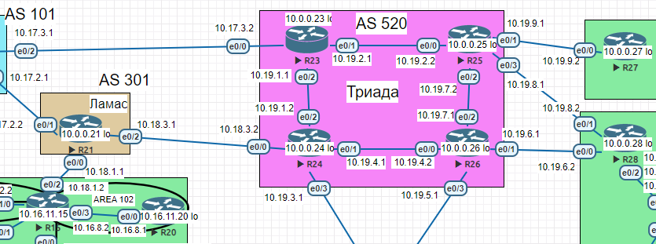

## Цель:

Настроить GRE между офисами Москва и С.-Петербург
Настроить DMVPN между офисами Москва и Чокурдах, Лабытнанги


## Задачи. 

1. Настроите GRE между офисами Москва и С.-Петербург.

2. Настроите DMVPN между Москва и Чокурдах, Лабытнанги.

3. Все офисы в лабораторной работе должны иметь IP связность.

### Часть карты участвующая в задании



### 1. Настроите GRE между офисами Москва и С.-Петербург.


```
R15(config)#interface Tunnel 2042
R15(config-if)#ip address 10.110.0.1 255.255.255.252
R15(config-if)#ip mtu 1400
R15(config-if)#ip tcp adjust-mss 1360
R15(config-if)#tunnel source 10.18.1.2
R15(config-if)#tunnel destination 10.19.3.2
R15(config-if)#keepalive 3 3
R15(config)#ip route 10.30.0.0 255.255.0.0 10.110.0.2
```

```
R18(config)#interface Tunnel 1001
R18(config-if)#ip address 10.110.0.2 255.255.255.252
R18(config-if)#ip mtu 1400
R18(config-if)#ip tcp adjust-mss 1360
R18(config-if)#tunnel source 10.19.3.2
R18(config-if)#tunnel destination 10.18.1.2
R18(config-if)#keepalive 3 3
R18(config)#ip route 10.16.3.0 255.255.255.0 10.110.0.1
R18(config)#ip route 10.16.2.0 255.255.255.0 10.110.0.1
```

Проверяем связность через GRE,ip адрес VPC7 не совпадает со схемой, т.к. получен по DHCP.

```
VPC> ping 10.16.3.127

84 bytes from 10.16.3.127 icmp_seq=1 ttl=60 time=2.657 ms
84 bytes from 10.16.3.127 icmp_seq=2 ttl=60 time=1.658 ms
84 bytes from 10.16.3.127 icmp_seq=3 ttl=60 time=1.437 ms
84 bytes from 10.16.3.127 icmp_seq=4 ttl=60 time=1.780 ms
84 bytes from 10.16.3.127 icmp_seq=5 ttl=60 time=1.515 ms

VPC>

```

```

VPC> trace 10.16.3.127
trace to 10.16.3.127, 8 hops max, press Ctrl+C to stop
 1   10.30.31.16   0.492 ms  0.298 ms  0.253 ms
 2   10.30.16.2   0.495 ms  0.330 ms  0.397 ms
 3   10.110.0.1   0.873 ms  0.651 ms  0.636 ms
 4   10.16.6.1   1.013 ms  0.777 ms  0.789 ms
 5   *10.16.3.127   1.043 ms (ICMP type:3, code:3, Destination port unreachable)

VPC>
```

Видно, что пакеты заворачиваются через GRE.

### 2. Настроите DMVPN между Москва и Чокурдах, Лабытнанги.

Фаза 1

R15 Москва HUB 
```
R15(config)#interface tunnel 100
R15(config-if)#tunnel mode gre multipoint
R15(config-if)#ip address 10.120.0.1 255.255.255.0
R15(config-if)#tunnel source 10.18.1.2
R15(config-if)#ip nhrp network-id 100
R15(config-if)#ip nhrp authentication cisco
R15(config-if)#ip nhrp map multicast dynamic
```

R27 Лабытнаги клиент

```
R27(config)#interface tunnel 100
R27(config-if)#ip address  10.120.0.2 255.255.255.0
R27(config-if)#tunnel source 10.19.9.2
R27(config-if)#tunnel destination 10.18.1.2
R27(config-if)#ip nhrp network-id 100
R27(config-if)#ip nhrp authentication cisco
R27(config-if)#ip nhrp map multicast 10.18.1.2
R27(config-if)#ip nhrp nhs 10.120.0.1
R27(config-if)#ip nhrp map 10.120.0.1 10.18.1.2
R27(config-if)#ip nhrp registration no-unique
```

R28 Чокурдах  за натом

```
R28(config)#interface tunnel 100
R28(config-if)#ip address  10.120.0.3 255.255.255.0
R28(config-if)#tunnel source ethernet 0/0
R28(config-if)#tunnel destination 10.18.1.2
R28(config-if)#ip nhrp network-id 100
R28(config-if)#ip nhrp authentication cisco
R28(config-if)#ip nhrp map multicast 10.18.1.2
R28(config-if)#ip nhrp nhs 10.120.0.1
R28(config-if)#ip nhrp map 10.120.0.1 10.18.1.2
R28(config-if)#ip nhrp registration no-unique
```

Тоннели поднялись

```
R15#show dmvpn
Legend: Attrb --> S - Static, D - Dynamic, I - Incomplete
        N - NATed, L - Local, X - No Socket
        T1 - Route Installed, T2 - Nexthop-override
        C - CTS Capable
        # Ent --> Number of NHRP entries with same NBMA peer
        NHS Status: E --> Expecting Replies, R --> Responding, W --> Waiting
        UpDn Time --> Up or Down Time for a Tunnel
==========================================================================

Interface: Tunnel100, IPv4 NHRP Details
Type:Hub, NHRP Peers:2,

 # Ent  Peer NBMA Addr Peer Tunnel Add State  UpDn Tm Attrb
 ----- --------------- --------------- ----- -------- -----
     1 10.19.9.2            10.120.0.2    UP 00:00:01     D
     1 10.19.6.2            10.120.0.3    UP 00:00:07     D
```

```
R15#show ip nhrp
10.120.0.2/32 via 10.120.0.2
   Tunnel100 created 00:03:11, expire 01:56:52
   Type: dynamic, Flags: registered used nhop
   NBMA address: 10.19.9.2
10.120.0.3/32 via 10.120.0.3
   Tunnel100 created 00:00:42, expire 01:59:22
   Type: dynamic, Flags: registered used nhop
   NBMA address: 10.19.6.2
```

Фаза 2

Меняем настройки интерфейса на обоих споках

```
R28(config)#interface Tunnel100
R28(config-if)#no tunnel destination 10.18.1.2
R28(config-if)#tunnel mode gre multipoint
```
Проверяем работу DMVPN

```
R28#show ip nhrp
10.120.0.1/32 via 10.120.0.1
   Tunnel100 created 00:08:38, never expire
   Type: static, Flags: used
   NBMA address: 10.18.1.2
10.120.0.2/32 via 10.120.0.2
   Tunnel100 created 00:03:53, expire 01:56:06
   Type: dynamic, Flags: router used nhop
   NBMA address: 10.19.9.2
10.120.0.3/32 via 10.120.0.3
   Tunnel100 created 00:03:53, expire 01:56:06
   Type: dynamic, Flags: router unique local
   NBMA address: 10.19.6.2
    (no-socket)
```